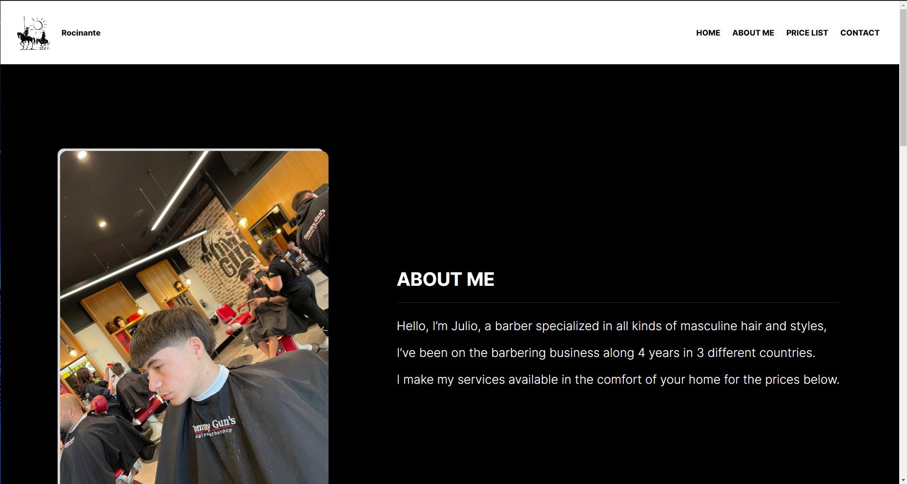

<h1 align="center"> Basic Portfólio </h1>

Programa realizado para aprimoramento de conhecimentos em HTML e CSS  

  <a href="#-tecnologias">Tecnologias</a>&nbsp;&nbsp;&nbsp;|&nbsp;&nbsp;&nbsp;
  <a href="#-projeto">Projeto</a>&nbsp;&nbsp;&nbsp;|&nbsp;&nbsp;&nbsp;
  <a href="#memo-licença">Licença</a>

  

 

  

## 🚀 Tecnologias

Esse projeto foi desenvolvido com as seguintes tecnologias:

- HTML e CSS
- Git e Github

## 💻 Projeto

Esse projeto foi idealizado como base de portfólio para um barbeiro australiano.

- [Acesse o projeto finalizado, online](https://devgustavopassos.github.io/Basic-Portoflio//)

## :memo: Licença

Esse projeto está sob a licença MIT.

---

Feito com ♥ by Gustavo
